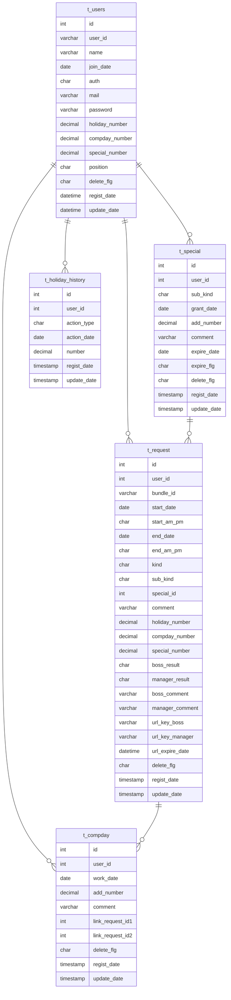

# 休暇申請システム（Gainful Management System）

## Overview
社内向けの休暇申請業務を効率化するためのWebアプリケーションです。  
ユーザーの申請から管理者のデータ管理を一元管理できる構成でPHP8を用いて開発しています。

## Demo
**URL**
- https://dolzap.conohawing.com/gainful/

**Demo Account**
- USER：demo@example.com
- PASS：demo1234

**Note**
- デモ環境では一部機能（管理機能・メール送信）に制限があります
- データは毎日0時に自動リセットされます

## Features
### User
- ログイン / ログアウト機能
- セッションタイムアウト機能
- 休暇申請機能（有休・代休・特別休暇申請）
- 休暇実績機能（一覧・絞り込み検索）
- 申請状況機能（一覧・取消）

### Admin
- 休暇承認機能（一覧・承認・却下）
- 承認状況機能（一覧・取消）
- ユーザー管理機能（一覧・登録・編集・削除）
- 申請データ管理機能（一覧・登録・編集・削除・絞り込み検索）
- 代休管理機能（一覧・登録・編集・削除・絞り込み検索）
- 特別休暇管理機能（一覧・登録・編集・削除・絞り込み検索）
- 休暇実績機能（一覧・絞り込み検索）

### Batch
- 有休付与機能
- 有休消滅機能
- 特別休暇付与機能（リフレッシュ休暇）
- 特別休暇消滅機能
- 実行ログ出力機能
- 多重起動防止機能
- デモデータリセット処理（毎日0時に実行）
- デモデータ再投入処理（毎日0時に実行）

## Stack
### Frontend


### Backend


### Infrastructure


### Others


## Directory
```bash
gainful/
├── htdocs/
│   ├── index.php             # ルーティング（ユーザー）
│   ├── admin/                # ルーティング（管理）
│   ├── ajax/                 # Ajax
│   ├── js/                   # JavaScript
│   ├── css/                  # CSS
│   └── img/                  # 画像
├── lib/
│   ├── conf/
│   │   └── Common.conf.php   # 定数設定
│   ├── sys/
│   │   ├── controllers/      # コントローラ
│   │   ├── modules/          # ビジネスロジック / DAO
│   │   └── batch/            # バッチ処理
│   └── templates/
│       ├── common/           # Smartyテンプレート（共通）
│       ├── auth/             # Smartyテンプレート（認証）
│       ├── user/             # Smartyテンプレート（ユーザー）
│       └── admin/            # Smartyテンプレート（管理）
├── packages/
│   ├── smarty/               # Smarty（外部）
│   └── adodb5/               # ADODB（外部）
├── logs/                     # ログ出力
└── .env                      # 環境変数
```

## Database
### t_users（ユーザーデータ）
| Column           | Type            | Null | Key | Default             | Description |
|------------------|-----------------|------|-----|---------------------|------------|
| id               | INT(11) UNSIGNED| NO   | PK  | -                   | ID |
| user_id          | VARCHAR(11)     | NO   | UQ  | -                   | ユーザーID |
| name             | VARCHAR(255)    | NO   | -   | -                   | 氏名 |
| join_date        | DATE            | NO   | -   | -                   | 入社年月日 |
| auth             | CHAR(1)         | NO   | -   | 0                   | 所属区分 |
| mail             | VARCHAR(255)    | NO   | UQ  | -                   | メールアドレス |
| password         | VARCHAR(255)    | NO   | -   | -                   | パスワード（ハッシュ化） |
| holiday_number   | DECIMAL(3,1)    | NO   | -   | 0.0                 | 有休残日数 |
| compday_number   | DECIMAL(3,1)    | NO   | -   | 0.0                 | 代休残日数 |
| special_number   | DECIMAL(3,1)    | NO   | -   | 0.0                 | 特別休暇残日数 |
| position         | CHAR(1)         | NO   | -   | 0                   | 権限区分 |
| delete_flg       | CHAR(1)         | NO   | -   | 0                   | 削除フラグ（論理削除） |
| regist_date      | DATETIME        | NO   | -   | CURRENT_TIMESTAMP   | 登録日時 |
| update_date      | DATETIME        | NO   | -   | CURRENT_TIMESTAMP   | 更新日時 |

### t_request（休暇申請データ）
| Column            | Type           | Null | Key | Default            | Description |
|-------------------|---------------|------|-----|--------------------|------------|
| id                | INT(11)       | NO   | PK  | -                  | ID |
| user_id           | INT(11)       | NO   | FK  | -                  | ユーザーID |
| bundle_id         | VARCHAR(32)   | NO   | -   | -                  | 申請グループID |
| start_date        | DATE          | NO   | -   | -                  | 申請開始日 |
| start_am_pm       | CHAR(1)       | NO   | -   | -                  | 開始区分 |
| end_date          | DATE          | NO   | -   | -                  | 申請終了日 |
| end_am_pm         | CHAR(1)       | NO   | -   | -                  | 終了区分 |
| kind              | CHAR(1)       | NO   | -   | -                  | 休暇種別 |
| sub_kind          | CHAR(1)       | YES  | -   | NULL               | サブ種別（特別休暇） |
| special_id        | INT(11)       | YES  | FK  | NULL               | 特別休暇ID |
| comment           | VARCHAR(255)  | NO   | -   | -                  | 事由 |
| holiday_number    | DECIMAL(3,1)  | NO   | -   | 0.0                | 有休消費日数 |
| compday_number    | DECIMAL(3,1)  | NO   | -   | 0.0                | 代休消費日数 |
| special_number    | DECIMAL(3,1)  | NO   | -   | 0.0                | 特別休暇消費日数 |
| boss_result       | CHAR(1)       | YES  | -   | NULL               | 承認ステータス（所属長） |
| manager_result    | CHAR(1)       | YES  | -   | NULL               | 承認ステータス（社長） |
| boss_comment      | VARCHAR(255)  | YES  | -   | NULL               | 却下理由（所属長） |
| manager_comment   | VARCHAR(255)  | YES  | -   | NULL               | 却下理由（社長） |
| url_key_boss      | VARCHAR(32)   | YES  | -   | NULL               | 承認リンク（所属長） |
| url_key_manager   | VARCHAR(32)   | YES  | -   | NULL               | 承認リンク（社長） |
| url_expire_date   | DATETIME      | YES  | -   | NULL               | 承認リンク有効期限 |
| delete_flg        | CHAR(1)       | NO   | -   | 0                  | 削除フラグ（論理削除） |
| regist_date       | TIMESTAMP     | NO   | -   | CURRENT_TIMESTAMP  | 登録日時 |
| update_date       | TIMESTAMP     | NO   | -   | CURRENT_TIMESTAMP  | 更新日時 |

### t_compday（代休データ）
| Column            | Type           | Null | Key | Default            | Description |
|-------------------|---------------|------|-----|--------------------|------------|
| id                | INT(11)       | NO   | PK  | -                  | ID |
| user_id           | INT(11)       | NO   | FK  | -                  | ユーザーID |
| work_date         | DATE          | NO   | -   | -                  | 休日勤務日 |
| add_number        | DECIMAL(3,1)  | NO   | -   | 0.0                | 付与代休日数 |
| comment           | VARCHAR(255)  | NO   | -   | -                  | 事由 |
| link_request_id1  | INT(11)       | YES  | FK  | NULL               | 代休申請ID（1回目） |
| link_request_id2  | INT(11)       | YES  | FK  | NULL               | 代休申請ID（2回目） |
| delete_flg        | CHAR(1)       | NO   | -   | 0                  | 削除フラグ（論理削除） |
| regist_date       | TIMESTAMP     | NO   | -   | CURRENT_TIMESTAMP  | 登録日時 |
| update_date       | TIMESTAMP     | NO   | -   | CURRENT_TIMESTAMP  | 更新日時 |

### t_special（特別休暇データ）
| Column        | Type           | Null | Key | Default            | Description |
|---------------|---------------|------|-----|--------------------|------------|
| id            | INT(11)       | NO   | PK  | -                  | ID |
| user_id       | INT(11)       | NO   | FK  | -                  | ユーザーID |
| sub_kind      | CHAR(1)       | NO   | -   | 0                  | 特別休暇種別 |
| grant_date    | DATE          | NO   | -   | -                  | 特別休暇付与日 |
| add_number    | DECIMAL(3,1)  | NO   | -   | 0.0                | 特別休暇付与日数 |
| comment       | VARCHAR(255)  | NO   | -   | -                  | 事由 |
| expire_date   | DATE          | NO   | -   | -                  | 有効期限 |
| expire_flg    | CHAR(1)       | NO   | -   | 0                  | 消滅フラグ |
| delete_flg    | CHAR(1)       | NO   | -   | 0                  | 削除フラグ（論理削除） |
| regist_date   | TIMESTAMP     | NO   | -   | CURRENT_TIMESTAMP  | 登録日時 |
| update_date   | TIMESTAMP     | NO   | -   | CURRENT_TIMESTAMP  | 更新日時 |

### t_holiday_history（有休履歴データ）
| Column       | Type           | Null | Key | Default            | Description |
|--------------|---------------|------|-----|--------------------|------------|
| id           | INT(11)       | NO   | PK  | -                  | ID |
| user_id      | INT(11)       | NO   | FK  | -                  | ユーザーID |
| action_type  | CHAR(1)       | NO   | -   | -                  | 処理区分 |
| action_date  | DATE          | NO   | -   | -                  | 処理日 |
| number       | DECIMAL(3,1)  | NO   | -   | 0.0                | 有休増減日数 |
| regist_date  | TIMESTAMP     | NO   | -   | CURRENT_TIMESTAMP  | 登録日時 |
| update_date  | TIMESTAMP     | NO   | -   | CURRENT_TIMESTAMP  | 更新日時 |

## ER


## License
MIT
